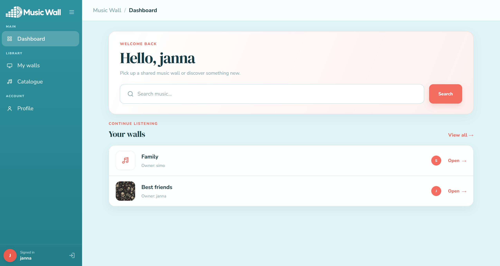

# Music Wall

Music Wall is a responsive collaborative web application for organising albums and tracks into personal listening walls. A registered user can create coloured sections, track what they want to hear, and share walls with other registered members.

This project was developed for the French RNCP *Concepteur Développeur d’Applications* certification. It uses a conventional Angular → Spring Boot → PostgreSQL architecture designed to remain clear, testable and easy to explain.



## Live application

- Frontend: [music-wall.netlify.app](https://music-wall.netlify.app)
- Backend API: [music-wall-backend.onrender.com](https://music-wall-backend.onrender.com)

The backend uses Render's free tier and may need a short time to wake up after a period of inactivity.

## Main features

- Register, log in and log out with a unique username and a password of at
  least eight characters.
- Authenticate protected requests with a JWT; store passwords as BCrypt hashes.
- View and edit a simple profile with bio and avatar.
- Create, view, rename, style and delete owned music walls.
- Create, edit and delete coloured sections.
- Search the local Artist/Album/Track catalogue and view details.
- Add exactly one catalogue album or track to a section.
- Change an item's status between `TO_LISTEN` and `LISTENED`.
- Search registered usernames and directly add or remove wall members.
- Let owners and members manage sections and items; reserve wall settings and membership management for the owner.
- Return from a catalogue detail to the original wall section through query parameters and a fragment.

The MVP intentionally has no email identity, invitation workflow or complex member roles. These are possible future improvements rather than partially implemented features.

## Technologies

| Area | Technology |
|---|---|
| Frontend | Angular 19, TypeScript 5.7, RxJS 7.8, HTML/CSS |
| Backend | Java 17, Spring Boot 3.5, Spring Web, Validation, Security, Data JPA |
| Security | JWT (JJWT), BCrypt, stateless Spring Security |
| Database | PostgreSQL 16, Hibernate |
| Initial catalogue source | MusicBrainz, through a separate development tool |
| Tests | JUnit 5, Mockito, MockMvc, H2 in PostgreSQL compatibility mode, Jasmine/Karma |
| Packaging | Maven Wrapper, npm, Docker, Docker Compose |
| Deployment | Nginx, Netlify and Render |

## Project structure

```text
music-wall/
├── backend/
│   ├── src/main/java/com/musicwall/
│   │   ├── controller/   HTTP entry points
│   │   ├── service/      business rules
│   │   ├── repository/   Spring Data database access
│   │   │   └── projection/ partial SQL query results used by repositories
│   │   ├── entity/       JPA persistence model
│   │   ├── dto/          request and response contracts
│   │   ├── security/     JWT and Spring Security
│   │   └── exception/    shared HTTP error handling
│   ├── src/test/         focused unit and integration tests
│   └── Dockerfile
├── frontend/
│   ├── src/app/
│   │   ├── components/   pages and wall subcomponents
│   │   ├── services/     API calls and shared behaviour
│   │   ├── models/       TypeScript API shapes
│   │   ├── guards/       protected-route check
│   │   └── interceptors/ Bearer-token attachment
│   ├── Dockerfile         Angular build + Nginx runtime
│   └── nginx.conf         SPA fallback and /api proxy
├── database/             schema helpers and catalogue seed
├── tools/                optional catalogue preparation tool
├── RNCP/                 dossier, diagrams, screenshots and defense notes
├── create-database.sql
└── docker-compose.yml
```

## Prerequisites

For local development:

- Java 17 or newer
- Node.js 20+ and npm
- PostgreSQL 16 (another supported recent PostgreSQL version should also work)

For the container route, Docker Desktop is enough for the complete application:
Angular/Nginx, Spring Boot and PostgreSQL.

## Database setup

The backend uses the dedicated database name `music_wall_rncp`. Keep it separate from databases used by other local applications.

Create the clean database:

```powershell
psql -U postgres -f create-database.sql
```

Then configure the backend:

```powershell
Copy-Item backend/.env.example backend/.env
```

Required values in `backend/.env`:

```properties
DB_URL=jdbc:postgresql://localhost:5432/music_wall_rncp
DB_USERNAME=postgres
DB_PASSWORD=replace_me
JWT_SECRET=replace_with_a_random_secret_of_at_least_32_characters
```

`JWT_SECRET`, `DB_USERNAME` and `DB_PASSWORD` have no committed production fallback. Hibernate creates/updates the RNCP schema; `schema.sql` adds the PostgreSQL trigram extension and catalogue search indexes after the tables exist.

After starting the backend once so that Hibernate can create the tables, populate a fresh catalogue:

```powershell
psql -U postgres -d music_wall_rncp -f database/catalogue_seed.sql
```

The seed contains catalogue reference data only. It never creates users, passwords, walls,
members, sections or listening states.

## Catalogue design

Normal application use is deliberately local:

```text
Angular -> Spring Boot -> PostgreSQL
```

MusicBrainz is not a runtime dependency. It is used only through the optional
standalone utility in `tools/musicbrainz-importer/` to prepare the initial SQL
seed:

```text
MusicBrainz -> external importer -> catalogue_seed.sql -> PostgreSQL
```

The backend has no MusicBrainz service, startup runner, provider configuration,
or provider identifiers in its entities and REST DTOs. Search and detail pages
therefore continue to work when the internet or MusicBrainz is unavailable. The
importer directory can be removed after database preparation without affecting
the application.

## Start locally

Backend, from `backend/`:

```powershell
.\mvnw.cmd spring-boot:run
```

Frontend, from `frontend/`:

```powershell
npm install
npm start
```

Open `http://localhost:4200`. The frontend calls `http://localhost:8080/api` by default.

## Tests and builds

Backend unit and integration tests:

```powershell
cd backend
.\mvnw.cmd test
```

The two integration test classes use an in-memory H2 database only under the
`test` profile. Their four tests cover registration and BCrypt persistence,
authenticated password changes, the 300-character bio boundary, and Wallpaper
enum JSON validation and string persistence.

Frontend test and production build:

```powershell
cd frontend
npm test
npm run build
```

The normal backend tests cover the local catalogue and focused wall/access/item
behaviour without internet access. Provider transformation tests live with the
optional external importer and use local JSON fixtures only.

## Docker

Copy the root environment example and replace all secrets:

```powershell
Copy-Item .env.example .env
docker compose up --build
```

Compose builds and starts the complete local application:

- `postgres`: PostgreSQL with database `music_wall_rncp`, exposed on host port `55432` by default;
- `backend`: the Spring Boot image, exposed on host port `8080`, connecting to PostgreSQL through the Compose service name `postgres`;
- `frontend`: the Angular production build served by Nginx on `http://localhost:4200`.

On a fresh database, the one-shot `catalogue-seed` service waits for the backend
schema and loads `database/catalogue_seed.sql` in a transaction. It skips the seed
when catalogue artists already exist and exits after the check, leaving the three
application containers running.

The browser calls `/api` on the same origin as the frontend. Nginx proxies that
path to `backend:8080` on the private Compose network and falls back to
`index.html` for Angular routes. Direct `npm start` development still uses
`http://localhost:8080/api` through the Angular development environment.

The named volume `music_wall_rncp_data` preserves only this RNCP database. Stop containers with `docker compose down`; add `-v` only when you intentionally want to erase that RNCP volume.

An image is the packaged template built from a Dockerfile. A container is a running instance of an image. Compose describes how the containers, environment variables, ports, health checks and private network fit together.

## Deployment

The production services remain separate even though they share one Git repository:

```text
Netlify (Angular) → /api redirect → Render (Spring Boot) → Render PostgreSQL
```

- `netlify.toml` builds the `frontend/` directory and provides the Angular route fallback.
- Netlify redirects `/api/*` requests to the Render backend, so production Angular can use `/api`.
- Render builds the backend from `backend/Dockerfile`.
- The backend needs `DB_URL`, `DB_USERNAME`, `DB_PASSWORD`, `JWT_SECRET` and `CORS_ORIGIN`.
- `CORS_ORIGIN` must contain the stable Netlify site URL, such as `https://music-wall.netlify.app`.
- Render's internal PostgreSQL hostname is used only by the backend, not by the browser.

## Main API endpoints

All endpoints except registration/login and public catalogue/profile reads require `Authorization: Bearer <token>`.

| Method | Endpoint | Purpose |
|---|---|---|
| POST | `/api/auth/register` | Register and receive a JWT |
| POST | `/api/auth/login` | Authenticate and receive a JWT |
| GET/PUT | `/api/profiles/{username}`, `/api/profiles/me` | Read/update a simple profile |
| POST/GET | `/api/profiles/me/avatar`, `/api/profiles/{username}/avatar` | Upload/read avatar bytes |
| GET | `/api/catalog/search?query=...` | Search local catalogue |
| GET | `/api/catalog/suggestions?query=...` | Autocomplete suggestions |
| GET | `/api/catalog/{artists\|albums\|tracks}/{id}` | Catalogue detail |
| POST/GET | `/api/walls` | Create/list accessible walls |
| GET/PUT/DELETE | `/api/walls/{wallId}` | Read or owner-update/delete wall |
| PUT | `/api/walls/{wallId}/appearance` | Owner changes colour/wallpaper |
| GET | `/api/walls/{wallId}/members` | Owner or member reads direct members |
| GET | `/api/walls/{wallId}/members/search?query=...` | Owner searches candidates |
| POST | `/api/walls/{wallId}/members` | Owner directly adds a username |
| DELETE | `/api/walls/{wallId}/members/{username}` | Owner removes a member |
| POST/PUT/DELETE | `/api/walls/{wallId}/sections[/{sectionId}]` | Owner/member manages sections |
| POST/PUT/DELETE | `/api/walls/{wallId}/sections/{sectionId}/items[/{itemId}]` | Owner/member manages items |

Controllers return DTOs directly for normal JSON and use `@ResponseStatus` for fixed `201`/`204` responses. `ResponseEntity<byte[]>` remains only for avatars because their media type is dynamic. `GlobalExceptionHandler` turns service exceptions and validation failures into consistent HTTP errors.

## Security overview

1. Registration hashes the password with BCrypt. Login asks Spring Security to verify the submitted password.
2. `JwtUtil` signs a token whose subject is the unique username; the global `ROLE_USER` remains because it fits Spring authorities without adding complexity.
3. Angular stores the token after authentication. `authInterceptor` adds it to backend requests.
4. `JwtFilter` validates the Bearer token, loads the user and places an authenticated object in `SecurityContext`.
5. `SecurityConfig` applies stateless access rules and CORS. `authGuard` prevents unauthenticated navigation in the browser, but backend security remains authoritative.
6. DTO validation limits incoming data. JPA parameters avoid handwritten SQL concatenation, Angular escapes interpolation by default, and stateless Bearer authentication avoids cookie-based CSRF exposure.

## Architecture and data model

The backend follows one readable path:

```text
Angular component → Angular service/HttpClient → Controller → Service
                  → Repository → JPA/Hibernate → PostgreSQL
```

- **Controllers** receive HTTP requests, validate DTOs and delegate the work.
- **Services** contain business rules, transactions and permission checks.
- **Repositories** read and save data with Spring Data JPA.
- **Entities** describe the database model.
- **DTOs** define the JSON exchanged with the frontend without exposing entities.
- **Projections** contain partial database-query results used internally by repositories.

The collaboration rule is equally direct:

```text
MusicWall.owner   = exactly one User
MusicWall.members = zero or more distinct Users (owner excluded)
```

`WallAccessService` is the only small authorization helper. It answers owner/access questions; it is not a general permission framework. Wall member operations intentionally remain in `MusicWallController` and `MusicWallService` because membership is part of the wall resource.

## RNCP resources

- [Project dossier](RNCP/01_Dossier_Projet/dossier-projet.docx)
- [MCD, MLD and MPD diagrams](RNCP/04_Diagrammes/)
- [Application screenshots and design evolution](RNCP/05_Captures/)
- [Catalogue seed documentation](database/README.md)

## Clean archive

```powershell
git archive --format=zip --output=music-wall-submission.zip HEAD
```

## Possible improvements

A future version could add invitations, friend requests, richer member roles, favourites, public-profile controls, statistics or concert discovery.
