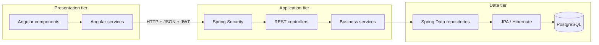
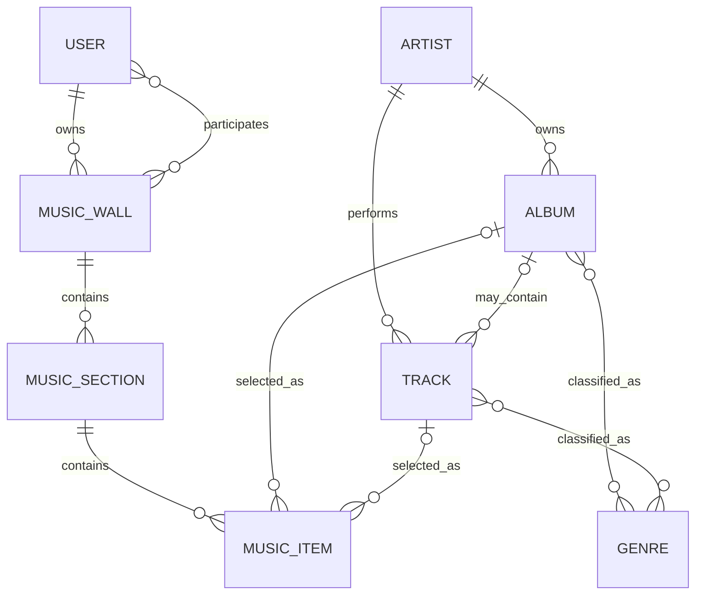
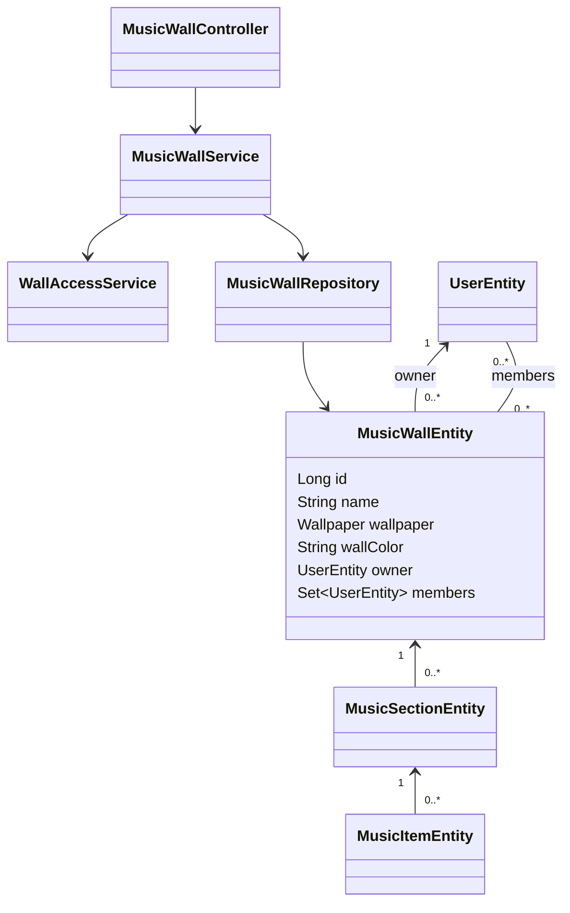
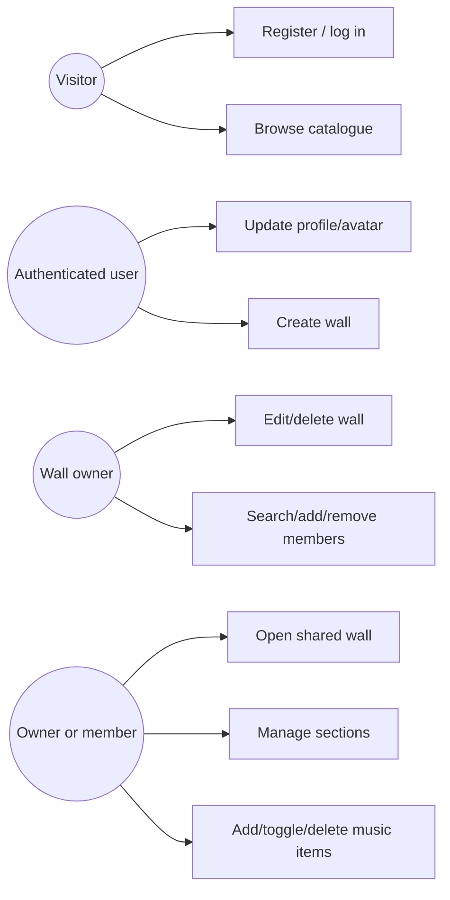
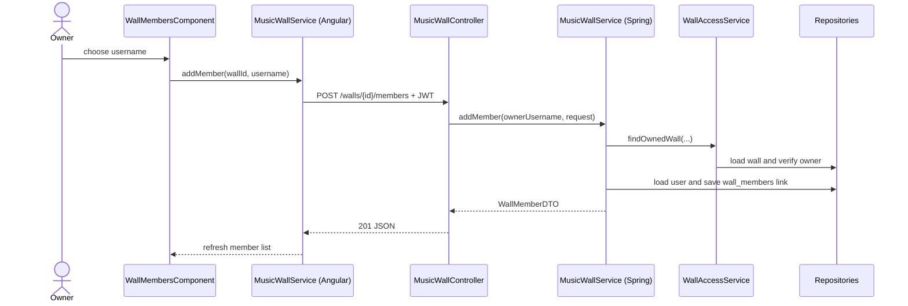

# Architecture and RNCP defense guide

This guide explains the actual RNCP implementation. The diagrams intentionally stay small enough to present one at a time.

## 1. Project framing

**Need:** two or more registered music lovers want a digital equivalent of a physical wall of listening notes.

**Target users:** small groups who organise albums/tracks together without needing a social network.

**MVP objective:** secure authentication, catalogue discovery, collaborative wall CRUD, simple access control, persistence, tests and repeatable deployment.

**Confidentiality:** passwords are never returned and are stored as BCrypt hashes; write operations require authentication; only an owner can change a wall or its members; only owner/member users can read and contribute to a shared wall. Catalogue and basic profile reads are public by design.

**Method:** the work can be presented as incremental Agile slices: isolate data, simplify domain, secure access, update UI, test, containerise, document. Git commits/branches provide traceability; the acceptance flows are usable as story-level checks.

## 2. Three-tier and layered architecture



MusicBrainz is outside this runtime diagram. Initial catalogue preparation is a
separate development process:

```text
MusicBrainz -> tools/musicbrainz-importer -> database/catalogue_seed.sql -> PostgreSQL
```

Once PostgreSQL is populated, the importer is not needed for startup, search,
detail pages, or adding catalogue music to a wall.

The three physical/logical tiers are browser, backend and database. Inside the backend, Controller → Service → Repository is the layered code structure. Keeping both views separate is useful in an oral defense.

## 3. MCD — conceptual data model



Key cardinality explanations:

- A wall has exactly one owner; a user can own zero to many walls.
- Users and walls have a many-to-many participation association. The owner is deliberately not duplicated as a member.
- Each section belongs to exactly one wall; each item belongs to exactly one section.
- A track has exactly one artist but may have zero or one album. The model honestly supports singles/unattached tracks.
- A music item references exactly one album **or** exactly one track. This XOR rule is enforced in `MusicItemService`.

## 4. MLD — relational model

```text
APP_USER(#id, username UQ, password, role, bio, avatar_image, avatar_content_type)
MUSIC_WALL(#id, name, wallpaper, wall_color, owner_id -> APP_USER.id)
WALL_MEMBERS(#wall_id -> MUSIC_WALL.id, #user_id -> APP_USER.id)
MUSIC_SECTION(#id, name, note_color, wall_id -> MUSIC_WALL.id)
MUSIC_ITEM(#id, title, artist, item_type, status,
           section_id -> MUSIC_SECTION.id,
           catalog_track_id -> TRACK.id NULL,
           catalog_album_id -> ALBUM.id NULL)
ARTIST(#id, name UQ)
ALBUM(#id, title, release_year, cover_url, artist_id -> ARTIST.id,
      UQ(artist_id, title))
TRACK(#id, title, duration_seconds, artist_id -> ARTIST.id,
      album_id -> ALBUM.id NULL)
GENRE(#id, name UQ)
ALBUM_GENRE(#album_id -> ALBUM.id, #genre_id -> GENRE.id)
TRACK_GENRE(#track_id -> TRACK.id, #genre_id -> GENRE.id)
```

`#` marks a primary-key column. Composite primary keys in join tables prevent duplicate associations.

## 5. MPD — PostgreSQL implementation

| Table | Important PostgreSQL columns and constraints |
|---|---|
| `app_user` | `id BIGINT identity PK`, `username VARCHAR(255) NOT NULL UNIQUE`, `password VARCHAR(255) NOT NULL`, `role VARCHAR(255) NOT NULL`, `bio VARCHAR(300)`, avatar `BYTEA` |
| `music_wall` | `id BIGINT identity PK`, `name VARCHAR(100) NOT NULL`, `wallpaper VARCHAR(20)`, `wall_color VARCHAR(7)`, `owner_id BIGINT NOT NULL FK` |
| `wall_members` | `wall_id BIGINT FK`, `user_id BIGINT FK`, composite PK |
| `music_section` | `id BIGINT identity PK`, `name VARCHAR(80) NOT NULL`, `note_color VARCHAR(20)`, `wall_id BIGINT NOT NULL FK` |
| `music_item` | `id BIGINT identity PK`, `title VARCHAR(180) NOT NULL`, `artist VARCHAR(150) NOT NULL`, enum strings, required section FK, nullable album/track FKs |
| `artist` | identity PK, `name VARCHAR(150) NOT NULL UNIQUE` |
| `album` | identity PK, `title VARCHAR(180) NOT NULL`, required artist FK, optional metadata, artist/title unique pair |
| `track` | identity PK, `title VARCHAR(180) NOT NULL`, required artist FK, **nullable** album FK |
| `genre` | identity PK, `name VARCHAR(80) NOT NULL UNIQUE` |

PostgreSQL's `pg_trgm` extension and GIN indexes accelerate case-insensitive catalogue name/title search. The service-level XOR validation remains clearer than a database check spanning two optional foreign keys for this teaching project.

## 6. Major UML classes



## 7. Use cases



`Owner` and `Collaborator` are business situations, not extra global database roles. The only global Spring authority stays `ROLE_USER`.
Both the owner and a direct member can read the wall's member list. Searching,
adding and removing members remains owner-only.

## 8. Sequence — add a member directly



There is no invitation, pending state or accept/reject branch.

## 9. Sequence — JWT authentication and protected request

```mermaid
sequenceDiagram
  actor User
  participant Angular
  participant Controller as AuthController
  participant Auth as AuthService
  participant Manager as AuthenticationManager
  participant Details as UserDetailsServiceImpl
  participant DB as UserRepository
  participant Encoder as PasswordEncoder / BCrypt
  participant JWT as JwtUtil
  participant Filter as JwtFilter
  participant Context as SecurityContext
  participant API as Protected controller/service
  participant Access as WallAccessService
  User->>Angular: username + password
  Angular->>Controller: POST /api/auth/login
  Controller->>Auth: login(request)
  Auth->>Manager: authenticate(username, password)
  Manager->>Details: loadUserByUsername(username)
  Details->>DB: findByUsername(username)
  DB-->>Details: user + BCrypt hash + role
  Details-->>Manager: UserDetails
  Manager->>Encoder: matches(raw password, stored hash)
  Encoder-->>Manager: password valid
  Manager-->>Auth: authenticated
  Auth->>DB: findByUsername(username)
  DB-->>Auth: UserEntity
  Auth->>JWT: generate token (subject=username)
  JWT-->>Auth: signed JWT
  Auth-->>Controller: AuthResponse (token, username, role)
  Controller-->>Angular: 200 JSON
  Angular->>Filter: protected request + Bearer JWT
  Filter->>JWT: extract username; verify signed claims
  Filter->>Details: loadUserByUsername(username)
  Details->>DB: findByUsername(username)
  DB-->>Details: user + role
  Filter->>JWT: validate signature, expiry and username
  Filter->>Context: set authenticated user
  Filter->>API: continue filter chain
  API->>Access: findAccessibleWall or findOwnedWall
  Access-->>API: authorised wall or 403
  API-->>Angular: protected response
```

`AuthenticationManager` delegates credential verification to Spring Security; the
application does not compare BCrypt hashes manually during login. For a protected
wall operation, HTTP authentication is followed by business authorization:
`findAccessibleWall(...)` accepts the owner or a direct member, while
`findOwnedWall(...)` accepts only the owner.

## 10. Frontend component tree

```text
AppComponent
└── LayoutComponent
    ├── SidebarComponent
    └── routed page
        ├── DashboardComponent
        ├── WallsComponent
        ├── WallDetailComponent
        │   ├── WallHeaderComponent
        │   ├── WallMembersComponent
        │   └── WallSectionComponent (one per section)
        │       ├── MusicItemComponent (one per item)
        │       └── CatalogueSearchComponent
        ├── CatalogComponent / CatalogDetailComponent
        └── ProfileComponent
```

`WallDetailComponent` owns route loading and orchestration. Its children have one purposeful UI responsibility and communicate with `@Input`, `@Output` and `EventEmitter`. Catalogue search uses only `Subject → debounceTime → distinctUntilChanged → switchMap` so stale HTTP searches are cancelled.

### Wall detail style ownership

`WallDetailComponent` owns only the page container, wallpaper, messages,
section-grid layout and add-section form. `WallHeaderComponent`,
`WallMembersComponent`, `WallSectionComponent`, `MusicItemComponent` and
`CatalogueSearchComponent` each own the styles for their local markup. Normal
Angular style encapsulation is used; no `ViewEncapsulation.None`, `::ng-deep`,
or styling framework is required.

## 11. Junior-friendly concept guide

### Angular concepts

- **Component:** a TypeScript class plus HTML/CSS for one screen or reusable UI part. Removing a routed component removes that page; removing a wall child pushes its responsibility back into an oversized parent.
- **Angular Service:** an injectable class for shared API or application behaviour. `MusicWallService` centralises wall URLs so components do not duplicate HTTP details.
- **HttpClient:** sends typed HTTP requests and converts JSON responses into TypeScript objects.
- **Observable:** represents a value that arrives later, such as an HTTP result or search input stream.
- **subscribe:** supplies success/error callbacks and starts an HTTP Observable. Without a subscription, these requests are not executed.
- **`@Input`:** parent-to-child data, such as a section passed into `WallSectionComponent`.
- **`@Output`:** child-to-parent events, such as “item changed”; `EventEmitter` carries that event.
- **Router / ActivatedRoute:** Router navigates; ActivatedRoute reads the current `:id`, query parameters and fragment. Together they implement wall → catalogue detail → original section without a generic history service.
- **Interceptor:** `authInterceptor` adds the JWT header in one place. Without it, every service would repeat token code and protected calls would return 401.
- **Guard:** `authGuard` blocks unauthenticated client navigation. It improves UX but cannot replace backend authorization because browser code can be bypassed.

### Backend and persistence concepts

- **Controller:** translates HTTP routes, parameters and authenticated username into service calls, then returns DTOs. Without controllers the API has no HTTP entry points.
- **Service:** holds business rules and transaction boundaries. Without it, rules leak into controllers or repositories and become harder to test.
- **Repository:** Spring Data interface for entity queries/persistence. Without it, services need manual EntityManager/SQL code.
- **Entity:** Java object mapped to a database table. It represents persistence, relationships and constraints—not the public API.
- **DTO:** explicit request/response shape. It prevents passwords, avatar bytes or lazy entity graphs from leaking into JSON and gives validation a clear home.
- **Dependency Injection:** Spring/Angular construct classes and supply dependencies. Tests can replace those dependencies with mocks.
- **Lombok:** generates repetitive Java boilerplate at compile time. `@RequiredArgsConstructor` is used only on touched services with final dependencies. Removing Lombok requires restoring those constructors; behaviour does not change.
- **JPA:** Java persistence specification and annotations such as `@Entity` or `@ManyToOne`.
- **Hibernate:** the JPA implementation that generates SQL and tracks entity changes inside transactions.
- **`ManyToOne`:** many walls can reference one owner; many sections can reference one wall.
- **`ManyToMany`:** many users can participate in many walls. It needs a join table because neither table can store several foreign keys in one column.
- **Join table:** `wall_members(wall_id, user_id)` stores one row per participation. Deleting this mapping removes collaboration while ownership remains.
- **Transaction:** a service operation's database work succeeds/fails as one unit and lazy relationships remain available while needed.

### Security concepts

- **JWT:** signed, time-limited token containing the username subject. It proves the token was issued by this backend; it is not encrypted storage for secrets.
- **Password validation and BCrypt:** registration and password change require
  at least eight characters. Accepted passwords are stored as slow salted
  BCrypt hashes; verification compares a candidate to the hash and the original
  password is not recoverable.
- **Spring Security:** filter chain, authentication manager, password encoder and endpoint rules.
- **JwtFilter:** runs before username/password security for each request, validates the Bearer token and loads user details. Removing it means JWTs no longer authenticate requests.
- **SecurityContext:** request-local place where Spring stores the authenticated principal used by controllers as `Authentication`.
- **CORS:** browser rule allowing the Angular origin to call the backend origin. It is configured to one environment-supplied origin, not `*`.
- **CSRF:** mainly protects cookie-authenticated browsers from forged state-changing requests. This API is stateless and uses an explicit Authorization header, so CSRF is disabled; JWT validation and CORS still apply.
- **XSS:** Angular interpolation escapes text by default. Avoiding unsafe HTML rendering helps keep stored user text from becoming executable script.
- **SQL injection:** repositories bind parameters rather than concatenating user input into SQL.

### HTTP security headers

- **`X-Content-Type-Options: nosniff`:** Spring Security prevents browsers from MIME-sniffing a response as a different content type.
- **`X-Frame-Options: DENY`:** Spring Security prevents the application from being framed, reducing clickjacking risk.
- **`Referrer-Policy: strict-origin-when-cross-origin`:** Nginx limits the referrer information sent with cross-origin requests.
- **`Permissions-Policy`:** Nginx disables the unused camera, microphone and geolocation browser capabilities.
- **Nginx server tokens:** `server_tokens off` prevents the exact Nginx version from being exposed.

CSP is not currently configured. HSTS is intentionally left for verification on the deployed HTTPS response.

### Testing and deployment concepts

- **Unit test:** checks one service in isolation with mocked dependencies. It is fast and pinpoints a business rule.
- **Mockito:** creates those mock repositories/services and verifies their interactions.
- **Integration test:** starts Spring and crosses controller, validation,
  security/service and repository layers. `AuthIntegrationTest` and
  `WallpaperIntegrationTest` use H2 only for this isolated test profile. Their
  four tests cover registration and BCrypt persistence, authenticated password
  changes, the 300-character bio boundary, and Wallpaper enum JSON validation
  and string persistence.
- **PostgreSQL:** real relational database for development/deployment, foreign keys and trigram catalogue search.
- **Dockerfiles:** repeatable multi-stage recipes for the Spring Boot JAR/runtime
  image and the Angular production build/Nginx runtime image.
- **Docker Compose:** starts Angular/Nginx, Spring Boot and PostgreSQL together,
  supplies configuration, creates a private network, waits for health checks and
  loads the reference catalogue once on a fresh schema.
- **Separate production deployment:** the local Compose topology does not force a
  single production deployment unit. Static Angular assets can be hosted on
  Netlify while Spring Boot and PostgreSQL remain separate Render services.

## 12. Important classes: why they exist and removal consequence

### Backend entry, security and errors

| Class | Why it exists | If removed |
|---|---|---|
| `MusicWallApplication` | Spring Boot entry point and component-scan root. | Backend cannot start normally. |
| `SecurityConfig` | Defines stateless routes, CORS, BCrypt and filter order. | Routes lose their intended protection/configuration. |
| `JwtUtil` | Generates, parses and validates signed JWTs. | Login cannot issue usable tokens and the filter cannot validate them. |
| `JwtFilter` | Converts a valid request token into Spring authentication. | Every protected JWT request remains anonymous. |
| `UserDetailsServiceImpl` | Adapts `UserEntity` to Spring Security's user model. | Authentication cannot load users/authorities. |
| `GlobalExceptionHandler` | Maps not-found, forbidden, validation and business exceptions to JSON HTTP errors. | Errors become inconsistent framework responses or 500s. |
| `BusinessException`, `ForbiddenException`, `ResourceNotFoundException` | Name the three expected error categories. | Services need vague generic exceptions and HTTP mapping becomes unclear. |

### Backend controllers and services

| Class | Why it exists | If removed |
|---|---|---|
| `AuthController` / `AuthService` | Registration/login HTTP routes and authentication rules. | Users cannot obtain accounts or tokens. |
| `ProfileController` / `ProfileService` | Simple bio/avatar read and update, including dynamic image media type. | Profile and avatar flows disappear. |
| `MusicWallController` / `MusicWallService` | Wall CRUD plus four direct-member operations as one resource. | Core product, ownership and collaboration disappear. |
| `WallAccessService` | Reuses the two explicit checks: owned wall and accessible wall. | Every wall/section/item service must duplicate security-sensitive checks. |
| `MusicSectionController` / `MusicSectionService` | CRUD for groups of notes within an accessible wall. | Walls cannot organise music by theme/genre. |
| `MusicItemController` / `MusicItemService` | CRUD/status and exactly-one album-or-track rule. | Sections cannot contain catalogue music. |
| `CatalogController` / `CatalogService` | Local catalogue search, suggestions and detail DTOs. | Users cannot browse or choose stored music. |

MusicBrainz import classes are intentionally absent from the backend. The
standalone development tool generates a provider-independent SQL seed and has
its own offline transformation tests.

### Entities and repositories

Each entity is the table representation and each same-named repository is its database gateway. `UserEntity/UserRepository` support identity and username search; `MusicWallEntity/MusicWallRepository` support ownership/direct participation; `MusicSectionEntity/MusicSectionRepository` and `MusicItemEntity/MusicItemRepository` form the wall hierarchy; `Artist`, `Album`, `Track`, `Genre` entities/repositories form the catalogue. Removing either an entity or its repository breaks every service that persists or queries that concept. `ListeningStatus` and `MusicItemType` restrict item state/type to known values; removing them turns valid states into unchecked strings.

### DTO families

Auth DTOs (`RegisterRequest`, `LoginRequest`, `AuthResponse`) define credentials/token data; wall request/detail/member DTOs define collaboration contracts; catalogue DTOs define nested search/detail results; profile DTOs keep password/avatar bytes out of normal JSON. Removing DTOs forces entities or untyped maps into the public API, coupling HTTP clients to the database model.

### Frontend classes

| Class | Why it exists | If removed |
|---|---|---|
| `AppComponent` / `LayoutComponent` / `SidebarComponent` | Root outlet and authenticated page shell/navigation. | The app has no stable visual/navigation frame. |
| `LoginComponent`, `RegisterComponent`, `AuthService` | Forms, token storage and auth API calls. | Users cannot enter the protected application. |
| `DashboardComponent` | Small authenticated landing page. | Default route has no destination. |
| `WallsComponent` | Lists and creates accessible walls. | Users cannot start/select the core resource. |
| `WallDetailComponent` | Loads route ID, owns shared state and refresh orchestration. | All wall child components lose their page coordinator. |
| `WallHeaderComponent` | Owner wall edit/delete/appearance UI. | Wall settings require returning to a monolithic parent or disappear. |
| `WallMembersComponent` | Owner search/add/remove and member list. | Direct collaboration cannot be managed in the UI. |
| `WallSectionComponent` | One section's editing, items and catalogue chooser. | Section behaviour returns to the oversized page component. |
| `MusicItemComponent` | One album/track display, status and removal events. | Repeated item behaviour must be duplicated in section markup. |
| `CatalogueSearchComponent` | Debounced, cancellable album/track selection. | Adding catalogue items becomes unavailable or synchronous/noisy. |
| `CatalogComponent`, `CatalogDetailComponent`, `CatalogService` | Browse/detail experience and return context. | Catalogue discovery/navigation disappears. |
| `ProfileComponent`, `ProfileService` | Bio/avatar page and API calls. | Profile functionality disappears. |
| `MusicWallService` (Angular) | Typed wall/section/item/member HTTP calls. | Components duplicate endpoints and request code. |
| `authInterceptor` | Adds Bearer token centrally. | Protected API calls fail unless every caller manually adds headers. |
| `authGuard` | Redirects unauthenticated navigation. | Protected pages flash/load before backend rejection. |
| `PageHeaderService` | Coordinates layout header presentation from routed pages. | Page-specific heading state no longer reaches the shell. |

## 13. Difficulties and design decisions to discuss

- Replacing a multi-state social workflow with direct membership required coordinated entity, query, authorization, endpoint and UI changes.
- A fresh `music_wall_rncp` database was safer and clearer than migrating obsolete social tables.
- Navigation context is explicit in `returnWallId`, `returnSectionId` and a fragment, so refresh/back behaviour does not depend on hidden global history state.
- Track-to-album remains optional even though mandatory cardinality would make a prettier diagram.
- Track identity remains the local primary key. No artist/title uniqueness rule
  is imposed because live, remastered and re-recorded versions can share a title.
- MusicBrainz prepared the initial reference catalogue but is not part of the
  normal application, MCD, REST API, or Spring configuration.
- H2 is limited to two isolated integration test classes covering registration
  and BCrypt persistence, authenticated password changes, the bio validation
  boundary, and Wallpaper enum serialization/persistence. PostgreSQL-specific
  trigram behaviour remains covered by the real database/manual Docker flow
  instead of compatibility hacks.
- `ResponseEntity` is avoided for ordinary DTO JSON but retained for avatar bytes because the response media type is data-dependent.

## 14. Zoning, wireframes and visual charter evidence

Existing Angular templates/CSS provide implementable zoning evidence: persistent sidebar/layout, dashboard zone, catalogue hero/search/results zones, wall header/members/section zones, item cards and profile modal. The visual charter uses the established teal/coral/pastel palette, rounded note/card shapes, Nunito for UI text and DM Serif Display for editorial headings. Screenshots of these running views can be placed beside low-fidelity wireframes in the RNCP dossier without adding product features.
